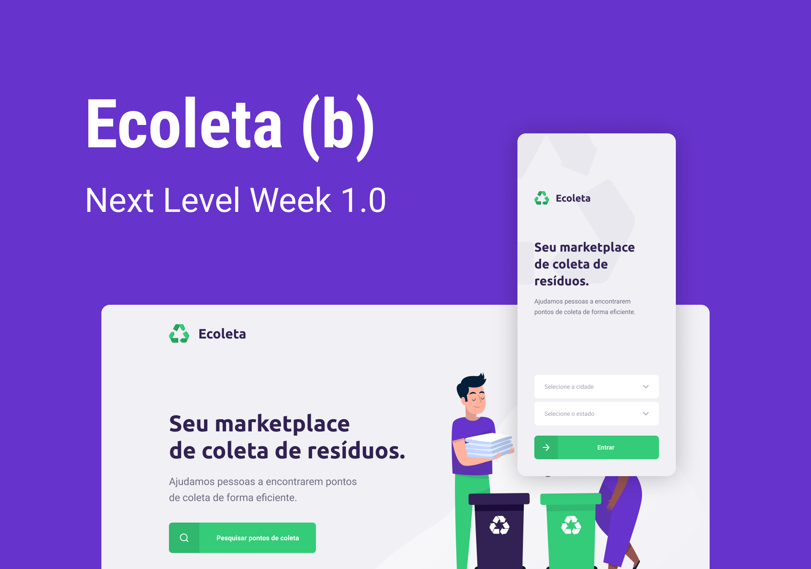

  # :recycle: Ecoleta 

Ecoleta is an application for registering and listing the collection point for recyclable materials developed during Rocketseat Next Level Week.

# :wrench: Technologies used

<ul style="list-style-type:none;">
  <a href="https://nodejs.org/en/"><li>Node.js</li></a>
  <a href="https://www.npmjs.com/"><li>NPM</li></a>
  <a href="https://expressjs.com/"><li>Express</li></a>
  <a href="https://www.npmjs.com/package/cors"><li>Cors</li></a>
  <a href="https://www.npmjs.com/package/multer"><li>Multer</li></a>
  <a href="https://www.npmjs.com/package/celebrate"><li>Celebrate</li></a>
  <a href="http://knexjs.org/"><li>Knex.js</li></a>
  <a href="https://pt-br.reactjs.org/"><li>ReactJS</li></a>
  <a href="https://www.npmjs.com/package/react-router-dom"><li>React-router-dom</li></a>
  <a href="https://react-leaflet.js.org/"><li>React leaflet</li></a>
  <a href="https://github.com/react-dropzone/react-dropzone"><li>React dropzone</li></a>
  <a href="https://www.npmjs.com/package/axios"><li>Axios</li></a>
  <a href="https://www.npmjs.com/package/react-icons"><li>React Icons</li></a>
  <a href="https://pt-br.reactjs.org/docs/hooks-intro.html"><li>React hooks</li></a>
  <a href="https://reactnative.dev/"><li>React Native</li></a>
  <a href="https://expo.io/"><li>Expo</li></a>
  <a href="https://reactnavigation.org/"><li>React Navigation</li></a>
</ul>

# :hammer: Getting Started

First things first we need to clone the repository 

``
git clone https://github.com/IlgssonBraga/ecoleta-NLW.git
``

## :green_book: Backend

 Once cloned, to access the backend we do 

``
cd backend/
``

 and to install dependencies 

``
npm install
``

 For add tables to database we do 

``
npm run knex:migrate
``

 and later for add items to table 'items', run 

``
npm run knex:seed
``

 Finally, to start server, run 

``
npm run dev
``

## :computer: Web

 In the cloned directory 

``
cd web/
``

 and to install dependencies 

``
npm install
``

 And run 

``
npm start
``

## :iphone: Mobile

 In the cloned directory 

``
cd mobile/
``

 and to install dependencies 

``
npm install
``

 And run 

``
npm start
``

 Install expo app on phone or emulator. Scan the QR code to run the project! 

<h3>Enjoy!! :rocket: :rocket:</h3>

# :memo: License 

This project is under MIT license. Look [License](LICENSE.md) for more details!

---

Made by [Ilgsson Braga](https://github.com/IlgssonBraga) with :heart:
